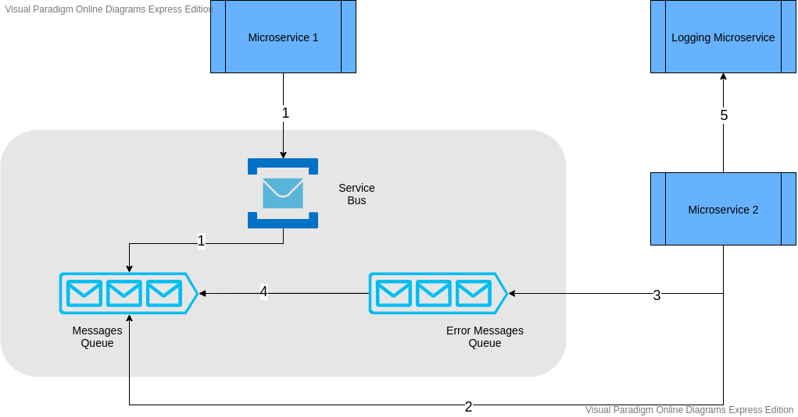

# Azure Service Bus + Queues Infrastructure

This repo is a Terraform template for provisioning the infrastructure of a Service Bus and two Queues inside it

In this README you will find:

1. Current state of infrastructure
2. How the information is intended to flow
3. How to make changes to this infrastructure
4. How to retrieve connection strings to send/retrieve messages from the queue

## 1 - Current state

At the present moment (14/09/2020) THE GRAY AREA of the following infrastructure is created by this repository:

To update this diagram go to <code>https://online.visual-paradigm.com/pt/diagrams/features/azure-architecture-diagram-tool/</code> and use the file in <code>readme_artifacts/Service Bus Diagram.vpd</code>

## 2 - How the information flows

According to the diagram we have:

1. Microservice 1 generates messages and post it to the messagesQueue.
2. Microservice 2 listens to messages from the Queue and process them. If it fails to process, post back to the same queue (for up to 5 times).
3. If it fails for more than 5 times, post the message to the Error Messages Queue.
4. The Error Messages Queue automatically posts back the errored messages to the regular queue after one hour (this parameter can be changed on file <code>modules/queue/variables.tf</code>)
5. Whether there's an error or success, Microservice 2 should always post log information to Logging Microservice

## 3 - How to make changes to this infrastructure

1. After making your changes, apply to the environment using the commands below.

2. Terraform init:
<code>terraform init 
    -backend-config "container_name=tfstatefiles" 
    -backend-config "storage_account_name=yourStorageAccount" 
    -backend-config "key=\<environment\>-tfstate.tfstate" 
    -backend-config "subscription_id=\<subscription id\>" 
    -backend-config "client_id=\<client id\>" 
    -backend-config "client_secret=\<client secret\>" 
    -backend-config "tenant_id=\<tenant id\>" 
    -backend-config "resource_group_name=yourResourceGroupName"</code>

3. Terraform plan:
<code>terraform plan 
    -var 'client_id=\<client id\>' 
    -var 'client_secret=\<client secret\>' 
    -var 'subscription_id=\<subscription id\>' 
    -var 'tenant_id=\<tenant id\>' 
    -var-file="rootVars.tfvars" 
    -var-file="rootVars-\<environment\>.tfvars" 
    -out tfout.log</code>

4. Terraform apply:
<code>terraform apply tfout.log</code>

## 4 - How to retrieve connection strings to send/retrieve messages from the queue

1. Perform <code>terraform init</code> pointing to the desired environment (using instructions of item 3.2 above)
2. Perform <code>terraform refresh</code> using the same parameters of terraform plan above (except "-out tfout.log"). It will print all the available parameters:
* Messages queue:
    * messages_queue_name
    * messages_queue_reader_connection_string
    * messages_queue_writer_connection_string
* Error queue: 
    * error_message_queue_name
    * error_messages_queue_writer_connection_string 
* Others:
    * resource_group_name

PS: should you have any error printing variables, it might mean different states between terraform state files and the actual infrastructure. To solve this run <code>terraform plan</code> as shown on step 3.3. Be aware that if you go ahead with these changes, you will discard anything done manually to the infrastructure